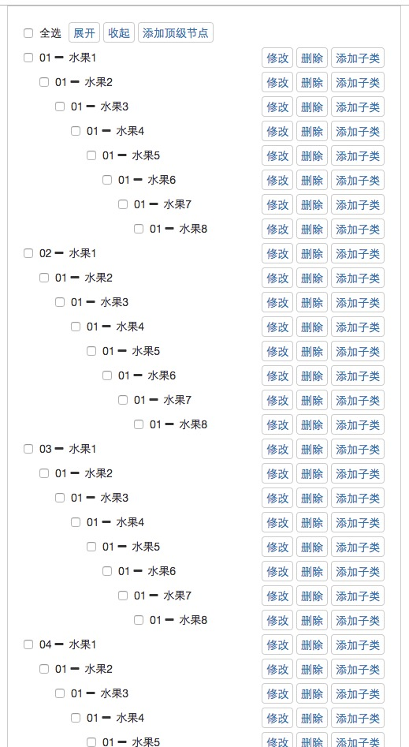
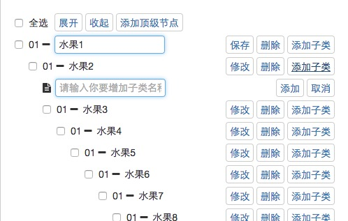
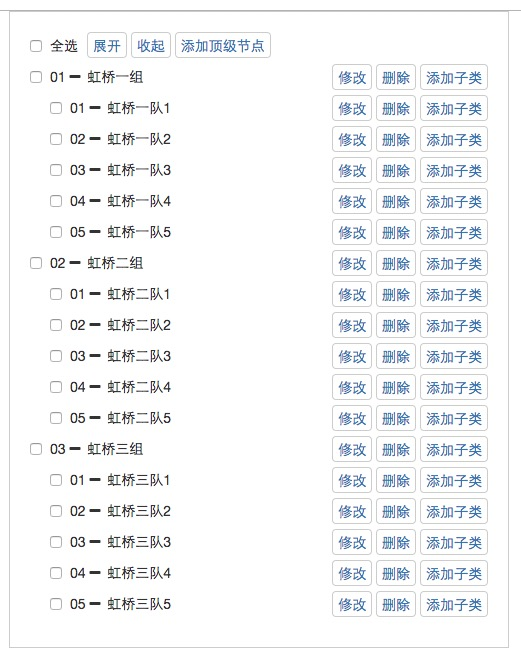

# DirectiveDemo
使用Directive做的自定义组件(树状图)后续更新~
## 功能为以下:
####  主，子级增删改查(目前暂未完成)
####  子级切换，转移成父节点(目前暂未完成)
####  拖拽修改节点

## 预览方式:
#### 项目拷贝到本地
`https://github.com/cw19931024/angular-tree.git`
#### 安装依赖
`npm install`
#### 或者网络不好使用
`cnpm install`
#### 启动本地服务
`gulp run`
#### 输入地址:
`http://localhost:1024`

##有时间会后续更新

#### 1.18更新





1:无限树节点
2:展开，收起
3:添加子和顶节点
4:修改，删除节点

#### 模拟json格式为:
```
[
    {"name":"水果","id":10,"children":[
        {"name":"水果1","id":20,"children":[
          ……  
        ]}
    ]}
]
```
后期会做参数处理、